# serbisyongScholar

<div align="center">
  
  
  
  
</div>

<p align="center">
  <strong>OAA Service Hour Tracking Portal</strong><br>
  A centralized hub for Ateneo Financial Aid scholars to securely track service hours, discover opportunities, and stay connected with the Office of Admission and Aid.
</p>

---

## Table of Contents

- [About](#about)
- [Why serbisyongScholar?](#why-serbisyongscholar)
- [Core Features](#core-features)
- [Screenshots](#screenshots)
- [Tech Stack](#tech-stack)
- [Installation](#installation)
- [Running the Application](#running-the-application)
- [API Documentation](#api-documentation)
- [Usage Instructions](#how-to-use-serbisyongscholar)
- [Project Structure](#project-structure)
- [Contributors](#contributors)
- [License](#license)

---

## About

**serbisyongScholar** (a portmanteau of the Filipino word *serbisyo* meaning "service" and "scholar") is a web-based service hour tracking system designed specifically for **Ateneo de Manila University (ADMU) Financial Aid Scholars**.

### What it does:
- Tracks service hours for scholars with real-time progress monitoring
- Provides a secure platform for encoding and managing service hour records
- Centralizes announcements and volunteer opportunities
- Offers voucher sign-ups for food stubs and events

### Who it's for:
- **Scholars**: Undergraduate financial aid recipients who need to fulfill service hour requirements
- **Moderators**: Participating offices (e.g., MVP Center, Rizal Library) that provide service opportunities
- **Administrators**: Office of Admission and Aid (OAA) staff who oversee the entire scholar community

## Why SerbisyongScholar?
Following the shutdown of the legacy service hour website during Intersession 2025–2026, scholars relied on a **public Google Spreadsheet** that exposed student IDs and service history to everyone. This created serious **data privacy concerns**. serbisyongScholar addresses this critical issue by providing:
- **Data Privacy**: Secure, role-based access control
- **Centralized Hub**: All information in one place
- **Real-time Updates**: No more manual spreadsheet checking
- **Mobile-Friendly**: Access anywhere, anytime
- **Penalty Enforcement**: Automatic penalty calculation for scholars who fail to meet hour requirements, carried into the following semester

---

## Core Features

### For Scholars 
- **Service Hour Dashboard**: View rendered hours, required hours, and carry-over balance
- **Progress Tracker**: Visual progress bar showing completion percentage
- **Service History**: Detailed log of all service activities
- **Announcements**: Stay updated with volunteer opportunities and urgent notices
- **Voucher Sign-ups**: Apply for food stubs (EBAIS, Kitchen City) and event tickets

### For Moderators 
- **Encode Service Hours**: Input hours for students after they complete service
- **Edit Entries**: Modify entries within a 7-day window
- **Create Announcements**: Request announcements for volunteer opportunities
- **View Encoding History**: Track all service hours encoded by your office
- **Create Vouchers**: Submit voucher listings (food stubs, event tickets) for admin approval

### For Administrators 
- **Admin Dashboard**: Overview of all scholars with completion statistics
- **Scholar Management**: Filter scholars by completion status, school, or program
- **Moderator Assignment**: Grant moderator access to partner offices
- **Announcement Approval**: Review and approve moderator-created announcements
- **Penalty Tracking**: Apply penalties for incomplete service hours
- **Audit Logs**: Track all system activities
- **Voucher Management**: Approve or reject scholar voucher applications
- **Semester Management**: Initialize semesters, set service hour deadlines, and process end-of-semester penalties

---

## Screenshots

### Landing & Authentication
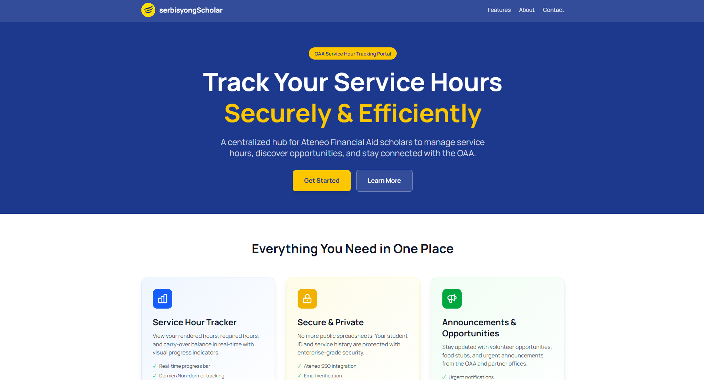
*Landing page with feature highlights*

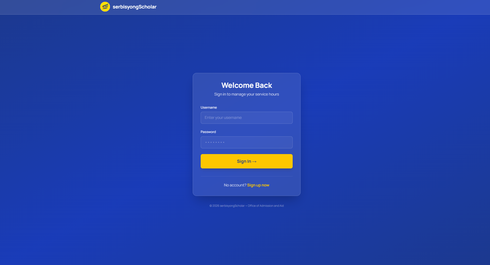
*Login page*

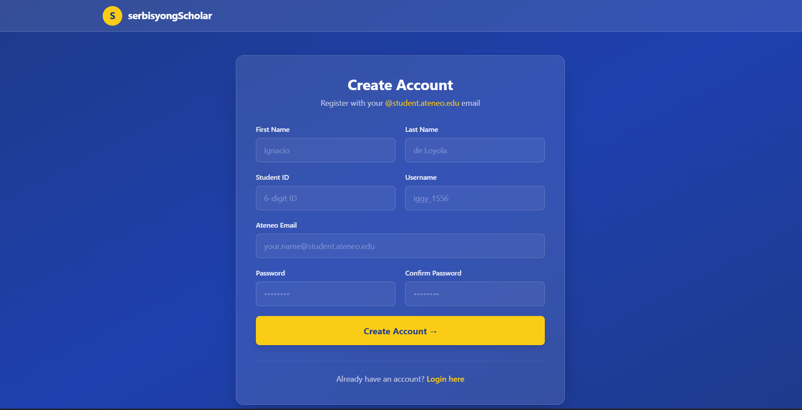
*Scholar sign-up page*

### Scholar Views
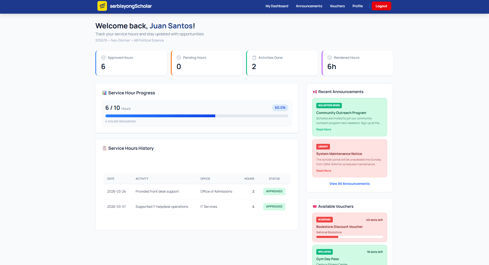
*Real-time service hour tracking with progress visualization*

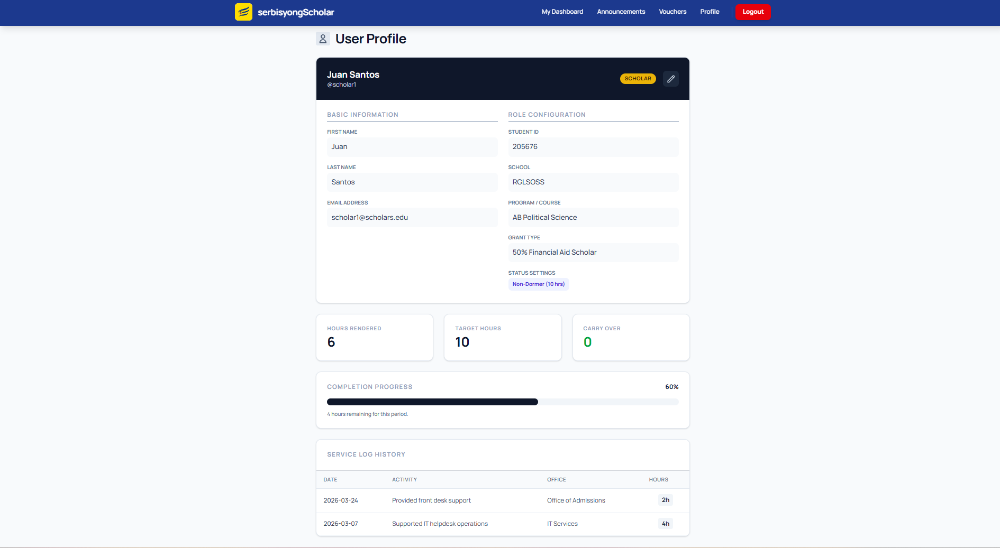
*Scholar profile and service log history*

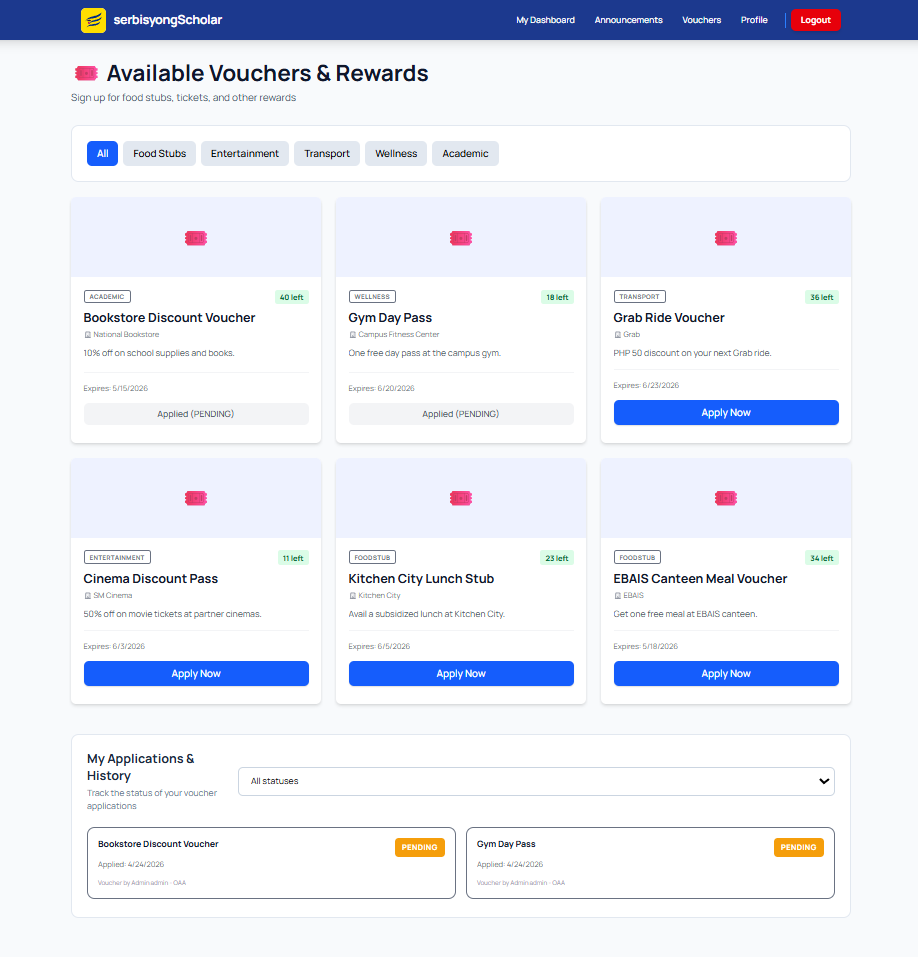
*Voucher browsing and application*

### Admin Views
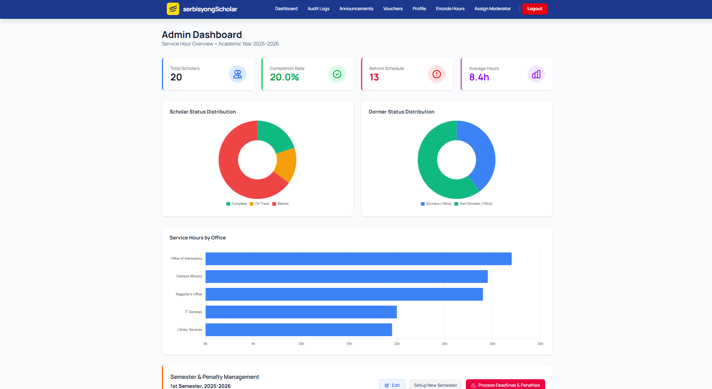
*Admin overview with scholar statistics and charts*

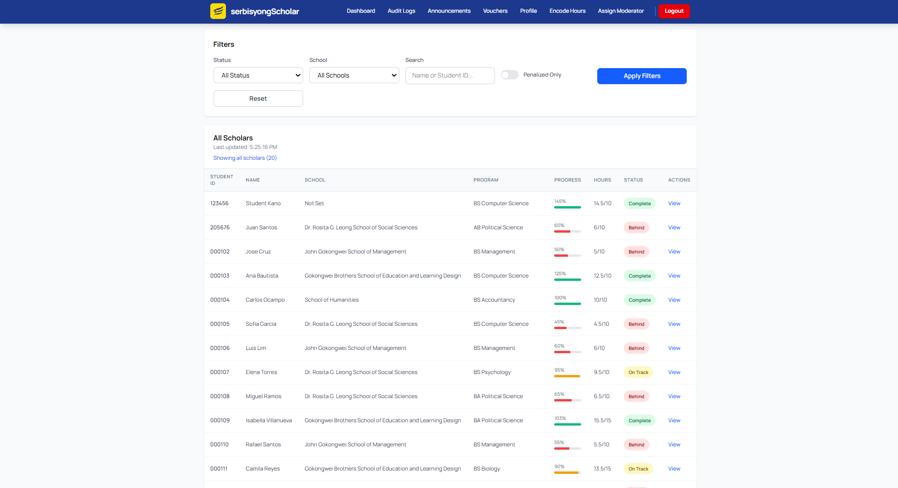
*Admin scholar list with filters and search*

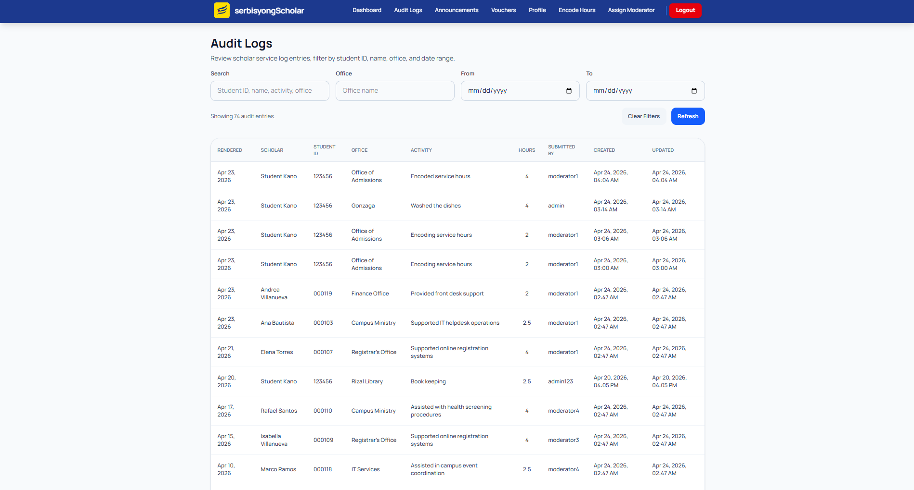
*Audit logs with search and date filtering*

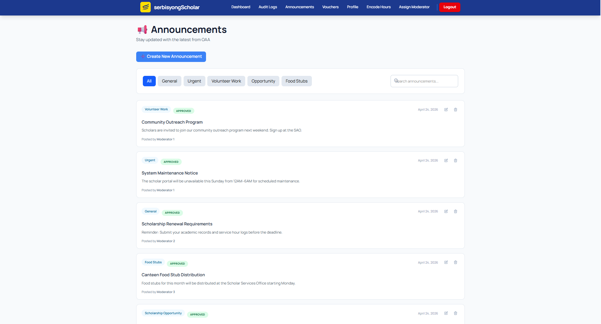
*Announcement approval workflow*

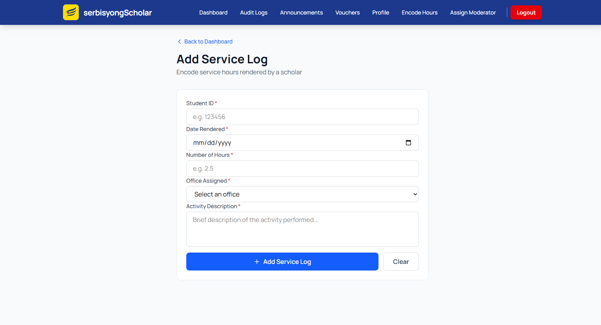
*Service hour encoding with real-time scholar validation*

---

## Tech Stack

### Frontend
- **Tailwind CSS** - Utility-first CSS framework
- **Axios** - HTTP client for API requests
### Backend
- **Django** 4.2.7 - Python web framework
- **Django REST Framework** 3.14.0 - API development
- **djangorestframework-simplejwt** 5.3.0 - JWT authentication
- **django-cors-headers** 4.3.1 - CORS handling

### Database
- **PostgreSQL** (Production) - Relational database
- **SQLite** (Development) - Lightweight database for local development

### Deployment
- **Vercel** - Frontend hosting
- **Neon** - PostgreSQL database hosting
- **GitHub** - Version control

---

## Installation

### Prerequisites
- Python 3.8+
- Node.js 16+
- PostgreSQL (optional, for production)
- Git

### 1. Clone the Repository
```bash
git clone https://github.com/your-team/serbisyongScholars.git
cd serbisyongScholars
```

### 2. Backend Setup (Django)

#### Create Virtual Environment
```bash
python -m venv venv

# On Windows
venv\Scripts\activate

# On Mac/Linux
source venv/bin/activate
```

#### Install Dependencies
```bash
pip install -r requirements.txt
```

#### Run Migrations
```bash
python manage.py makemigrations
python manage.py migrate
```

#### Create Superuser (Admin)
```bash
python manage.py createsuperuser
# To create admin account, follow instructions from Django
```

## Running the Application

### Development Mode

#### Terminal 1: Run Django Backend
```bash
cd serbisyongScholars
source venv/bin/activate  # or venv\Scripts\activate on Windows
python manage.py runserver
```
Backend/Frontend will run on: **http://localhost:8000**


### Access Points
- **Django Admin**: http://localhost:8000/admin
- **API Endpoints**: http://localhost:8000/api/

---

## API Documentation

### Authentication Endpoints

#### 1. Sign Up
```http
POST /api/auth/signup/
Content-Type: application/json

{
  "username": "scholar123",
  "email": "scholar@student.ateneo.edu",
  "password": "SecurePass123!",
  "password_confirm": "SecurePass123!",
  "first_name": "Juan",
  "last_name": "Dela Cruz",
  "student_id": "123456"
}

Response: 201 Created
{
  "message": "User created successfully. Please verify your email.",
  "user": {
    "username": "scholar123",
    "email": "scholar@student.ateneo.edu"
  },
  "tokens": {
    "refresh": "...",
    "access": "..."
  }
}
```

#### 2. Login
```http
POST /api/auth/login/
Content-Type: application/json

{
  "username": "scholar123",
  "password": "SecurePass123!"
}

Response: 200 OK
{
  "tokens": {
    "refresh": "...",
    "access": "..."
  },
  "user": {
    "username": "scholar123",
    "email": "scholar@student.ateneo.edu",
    "role": "SCHOLAR"
  }
}
```

### Scholar Endpoints

#### 3. Get Scholar Dashboard
```http
GET /api/scholar/dashboard/?username=scholar123
Authorization: Bearer {access_token}

Response: 200 OK
{
  "student_id": "123456",
  "name": "Juan Dela Cruz",
  "program": "BS Computer Science",
  "is_dormer": false,
  "required_hours": 15.0,
  "rendered_hours": 12.0,
  "carry_over": 0.0,
  "service_logs": [
    {
      "date": "2026-02-15",
      "hours": 3.0,
      "office": "Rizal Library",
      "activity": "Book Sorting"
    }
  ]
}
```

### Moderator Endpoints

#### 4. Encode Service Hours
```http
POST /api/moderator/encode/
Authorization: Bearer {access_token}
Content-Type: application/json

{
  "student_id": "123456",
  "date_rendered": "2026-02-20",
  "hours": 4.0,
  "office_name": "MVP Center",
  "activity_description": "Event Setup and Coordination"
}

Response: 201 Created
{
  "message": "Service hours encoded successfully",
  "log_id": 42
}
```

### Admin Endpoints

#### 5. Get All Scholars (Admin Only)
```http
GET /api/admin/scholars/?status=incomplete
Authorization: Bearer {access_token}

Response: 200 OK
{
  "total": 150,
  "complete": 120,
  "incomplete": 30,
  "scholars": [...]
}
```

---

## How to Use SerbisyongScholar

### For Scholars

1. **Sign Up**
   - Go to the landing page
   - Click "Get Started" or "Sign Up"
   - Fill in your details with your Ateneo email
   - Verify your email through the confirmation link

2. **Login**
   - Enter your username and password
   - You'll be redirected to your dashboard

3. **View Service Hours**
   - Dashboard shows your progress bar
   - Check "Service Hours History" for detailed logs
   - View remaining hours needed

4. **Apply for Vouchers**
   - Navigate to "Vouchers" page
   - Browse available food stubs or event tickets
   - Click "Apply" to submit your application

### For Moderators

1. **Encode Service Hours**
   - Navigate to "Encode Hours"
   - Enter student ID, date, hours, and activity
   - Click "Submit" to record

2. **Edit Entries**
   - Go to "Encoding History"
   - Click "Edit" on entries (within 7 days)
   - After 7 days, contact Admin for changes

### For Administrators

1. **View All Scholars**
   - Access "Admin Dashboard"
   - Filter by completion status
   - View detailed scholar information

2. **Assign Moderator Roles**
   - Go to "Manage Users"
   - Search for the user
   - Click "Edit" → Change role to "Moderator"

3. **Approve Announcements**
   - Navigate to "Manage Announcements"
   - Review pending announcements
   - Click "Approve" or "Reject"

---

## Project Structure

```
serbisyongScholars/
│
├── scholarapp/                    # Main Django app
│   └── migrations/
│
├── serbisyongScholars/            # Django project settings
│   ├── settings.py
│   ├── urls.py
│   └── wsgi.py
│
├── static/                        # Static source files
│   ├── css/
│   ├── img/
│   └── js/
│
├── staticfiles/                   # Collected static files (auto-generated)
│   └── rest_framework/
│       ├── css/
│       ├── docs/
│       ├── fonts/
│       ├── img/
│       └── js/
│
├── templates/                     # HTML templates
│
├── screenshots/                   # README screenshots
│
├── db.sqlite3                     # Development database
├── manage.py
├── requirements.txt
├── .gitignore
└── README.md

```

---

## Contributors

**Team: Summa Coders**  
*CSCI 42 - INTRODUCTION TO SOFTWARE ENGINEERING*  
*Ateneo de Manila University*

| Name | Role | GitHub |
|------|------|--------|
| **Biason, Neil Aldous** | Full-Stack Engineer & Integration Lead | [@r1tsuuu](https://github.com/r1tsuuu) |
| **Gines, Juan Paolo** | Backend Developer & Database Lead, Systems Documentation Officer | [@vayporizer](https://github.com/vayporizer) |
| **Malonzo, Rob Sebastian** | UI/UX & Mobile Designer, QA Lead | [@robmalonzo](https://github.com/robmalonzo) |
| **Naguio, Christian** | Frontend Developer & UI Lead | [@loltreeman](https://github.com/loltreeman) |
| **Sabio, Jedale** | Backend Developer & Security Lead | [@studentidle](https://github.com/studentidle) |

### Special Thanks
- **Sir Butch Adrian Castro** - For mentorship throughout development

---

## License

This project is developed as part of the **CSCI 42 - Software Engineering** course at Ateneo de Manila University.

**MIT License**

Copyright (c) 2026 Summa Coders

Permission is hereby granted, free of charge, to any person obtaining a copy of this software and associated documentation files (the “Software”), to deal in the Software without restriction, including without limitation the rights to use, copy, modify, merge, publish, distribute, sublicense, and/or sell copies of the Software, and to permit persons to whom the Software is furnished to do so, subject to the following conditions:

The above copyright notice and this permission notice shall be included in all copies or substantial portions of the Software.

THE SOFTWARE IS PROVIDED “AS IS”, WITHOUT WARRANTY OF ANY KIND, EXPRESS OR IMPLIED, INCLUDING BUT NOT LIMITED TO THE WARRANTIES OF MERCHANTABILITY, FITNESS FOR A PARTICULAR PURPOSE AND NONINFRINGEMENT. IN NO EVENT SHALL THE AUTHORS OR COPYRIGHT HOLDERS BE LIABLE FOR ANY CLAIM, DAMAGES OR OTHER LIABILITY, WHETHER IN AN ACTION OF CONTRACT, TORT OR OTHERWISE, ARISING FROM, OUT OF OR IN CONNECTION WITH THE SOFTWARE OR THE USE OR OTHER DEALINGS IN THE SOFTWARE.

---

## Roadmap

All four iterations completed as of April 2026. 

---

## Additional Resources

- [Django Documentation](https://docs.djangoproject.com/)
- [Tailwind CSS Documentation](https://tailwindcss.com/docs)

---
